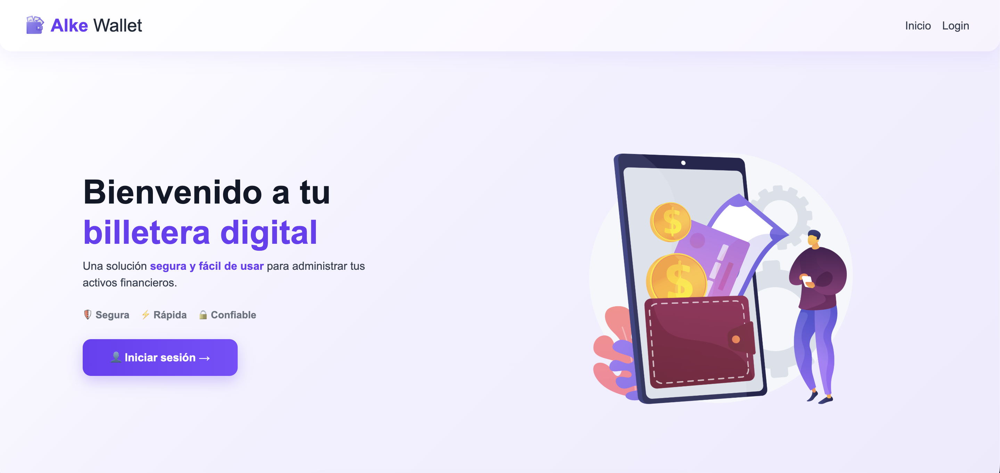
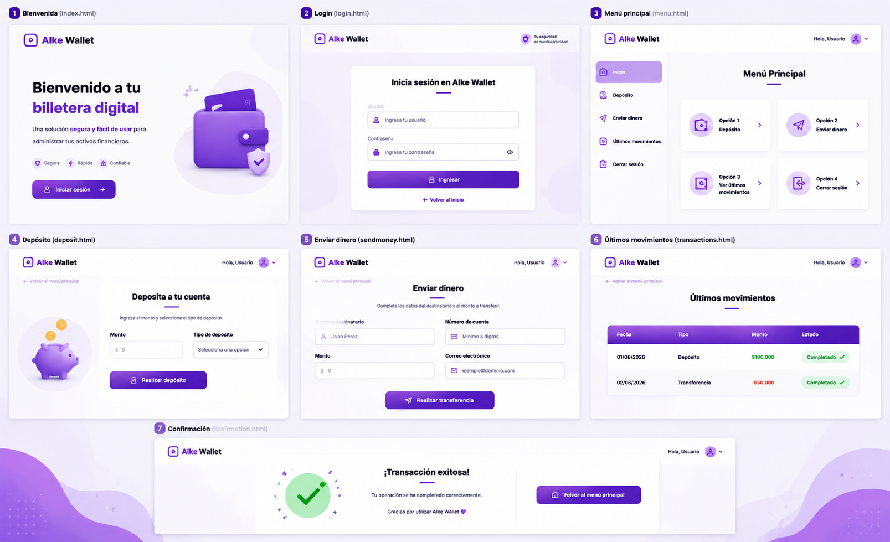

# Alke Wallet 💳

Proyecto de billetera digital desarrollado como parte del bootcamp de frontend.  
Permite simular login, depósitos, transferencias y visualizar un historial dinámico de transacciones.

---

## 🚀 Demo
👉 [Ver proyecto en línea](https://gdiazcontreras.github.io/alke-wallet/)

## 🔑 Credenciales de prueba
Para ingresar a la aplicación usar las siguientes credenciales:

- Usuario: **usuario@email.com**
- Contraseña: **123456**

---

## 📸 Capturas
### Index

### Maquetas

---

## 🛠️ Tecnologías utilizadas
- HTML5  
- CSS3 (con `global.css` para estilos comunes y archivos específicos por página)  
- JavaScript (validaciones y lógica de transacciones)  
- jQuery  
- Git & GitHub Pages (deploy)

---

## 📌 Funcionalidades
- Login con validación básica  
- Depósitos con actualización dinámica del saldo  
- Transferencias con validación de monto y saldo suficiente  
- Historial de transacciones en tabla  
- Estadísticas de ingresos, egresos y balance  
- Estilos consistentes con `global.css` (navbar, footer, botones, alertas)

---

## 📂 Estructura del proyecto
/css
global.css
login.css
menu.css
deposit.css
sendmoney.css
transactions.css
index.css
/js
app.js
/img
(íconos y recursos gráficos)
index.html
login.html
menu.html
deposit.html
sendmoney.html
transactions.html

---

## 🧑‍💻 Autor
**Gabriela Díaz Contreras**  
Bootcamp Frontend Developer · 2026
